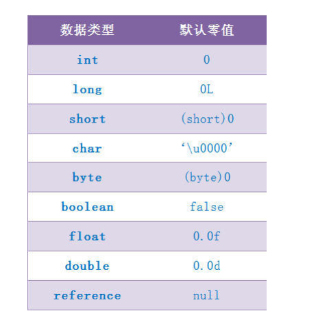

# JVM

## jvm分析

为什么使用JVM?


**字节码和机器码的区别？**

- 机器码是电脑cpu直接读取运行时的机器指令，运行速度最快，但是非常晦涩难懂。一般从业人员基础不到。
- 字节码是一种中间状态的二进制代码文件，需要直译器转译后才能成为机器码。

JDK JRE JVM关系

JDK: java 开发工具包

JRE:java运行时环境

JVM:java虚拟机


OpenJDK OracleJDK的关系 Oracle JDK 10以后要收费

JVM和Hotspot的关系是什么

JVM是《JVM虚拟机规范》中提出来的规范

Hotspot是使用jvm规范的商用产品，除此之外还有BEA、Jrockit、IBM的J9也是JVM产品

JVM和Java的关系是什么

java语言 Scala语言 Groovy语言 其他语言 编译成 class 语言 ，在JVM中运行

JVM两种运行模式： cliean、server

​	两种方式的区别与联系：

1. client模式的启动速度比较快，server模式的启动速度比较慢
2. 但是启动后进入长期稳定的运行态server模式的程序运行速度比clent快
3. 但是因为server模式启动jvm采用的是重量级的虚拟机，对程序进行了很对优化；而client模式启动虚拟机采用的是轻量级的虚拟机，所以server启动速度慢，但是稳定后比client运行速度快

JVM架构图


### jvm执行流程

java代码编译成字节码文件，动态编译和解释为机器码的过程分析：


编译器和解释器协调工作流程分析：


## JIT即使编译器

**在部分商用虚拟机中如（Hotspot），java程序最初是通过解释器（Interpreter）进行解释执行的，当虚拟机发现某个方法或者代码块运行特别频繁的时候，就会认为这段代码为热点代码，为了提高热点代码在虚拟机中的执行效率，在运行时，虚拟机会将这些代码编译成与本地平台无关的机器码，进行各层的优化，完成这个任务的编译器被称作即时编译器（Just In Time Compiler，统称为JIT）**

解释器和编译器的优缺点？

- 程序需要快速启动时，为了省去编译时间，用解释器。程序运行后，随着时间的推移，编译器逐渐发挥作用，把越来越多的代码编译成本地代码后，可以获得更高的执行效率。
- 当程序运行环境中的资源限制比较大，可以使用解释器节约内存，反之用编译器

热点代码的动态编译

动态编译的一种：在运行时进行编译，狭义的来说某一段代码即将执行时进行编译，JIT编译是以方法为单位进行编译的，编译成机器码

**如何判断是否时热点代码？**如何去记录方法调用次数和循环体的循环次数呢？

基于计数器：

- **方法调用计数器**：方法对象中去存储调用次数
- **回边计数器**：每一次循环回去，都会记录一次次数

解释器：逐条解释进行编译

**JVM为什么需要使用解释器和编译器并存的架构？**

- 当程序需要迅速启动和执行的时候，解释器首先发挥作用，省去代码编译的时间，立即执行。在程序运行后，随着时间的推移，编译器逐渐发挥作用，把越来越多的代码编译成本地代码后，可以获得更高的执行效率
- 当程序运行环境中内存资源限制较大，可以使用解释器执行节约内存，反之需要使用编译器来提升性能

**JVM为什么需要两个即时编译器？**

- HotSpot虚拟机内置了两个即时编译器：Client Compiler和Server Compiler，简称为c1和c2编译器。分别用在客户端和服务端

- 目前主流的HotSpot虚拟机默认是采用解释器与其中一个编译器直接配合的方式工作。程序使用哪一个编译器取决于虚拟机的运行模式
- 用Client Compiler获得更高的编译速度，用Server Compiler获得更好的编译质量

**哪些程序会被编译？**

只有代码是热点代码时，才会编译为本地代码，**那么什么是热点代码？**分两类

- 多次被调用的方法
- 被多次执行的循环体

### JIT优化

- 公共子表达式消除：是一种普遍用于各种编译器的经典的优化方法，它的含义是：如果一个表达式已经计算过了，而且从计算到现在E中的值没有发生变化，那么E的这次出现就成了公共子表达式。对于这种表达式没有必要再进行计算。只需要直接用前面计算过的表达式结果代替E即可。


- 方法内联：将方法调用直接使用方法体中的代码进行替换，减少了方法调用过程中的压栈与入栈的开销


- 逃逸分析（Escape Analysis）：有效减少java程序中同步负载和内存堆分配压力。逃逸分析的基本行为就是分析对象的动态作用域：当一个对象在方法上被定义后，它可能被外部方法引用。例如作为调用参数传递到其他方法中，称为方法逃逸。
  - 逃逸分析包括：
    - 全局变量逃逸分析
    - 方法返回值逃逸
    - 实例引用逃逸
    - 线程逃逸：赋值给类变量或者可以在其他线程中访问的实例变量
  
- 对象的栈上内存分配：我们都知道一般对象和数组的内存分配都是在堆上进行的，但是随着jit即时编译技术的成熟，很多优化使得这种分配策略并不绝对。jit即时编译器就可以在编译期间根据逃逸分析的结果，类决定对象的内存分配是否可以从堆上转移到栈上

- 标量替换：

  - **标量**是指一个无法再分解为更小数据的数据。

  如果在JIT阶段发现一个对象没有被外界访问。那么经过JIT优化，会把这个对象拆解成其所包含的成员变量来替换。

  

- 同步锁消除 ：同样基于逃逸分析，当加锁的变量不会发生逃逸，是线程私有的完全没有必要加锁。在编译期就可以将同步锁去掉，以减少加锁和解锁引起的资源开销
  - -XX:+DoEscapeAnalysis -XX:-EliminateLocks (开启逃逸分析，关闭同步锁消除  )
  - -XX:+DoEscapeAnalysis -XX:+EliminateLocks(开启逃逸分析，开启同步锁消除)

jdk1.7默认开启了逃逸分析

jmap -histo 进程号

##  class文件分析

**常量池在class文件中的位置？**


| 类型                | 名称                       | 数量                  |
| ------------------- | -------------------------- | --------------------- |
| u4（u4代表4个字节） | magic（魔数）              | 1                     |
| u2                  | minor_version(jdk次版本哈) | 1                     |
| u2                  | major_version(jdk主版本号) | 1                     |
| u2                  | constant_pool(常量池)      | 1                     |
| cp_info             | constant_pool(常量表)      | constant_pool_count-1 |
| u2                  | access_flags(访问标志)     | 1                     |
| u2                  | this_class(类引用)         | 1                     |
| u2                  | super_class(父类引用)      | 1                     |
| u2                  | interface_count(接口数量)  | 1                     |
| u2                  | interfaces(接口数组)       | interfaces_count      |
| u2                  | fields_count(字段数量)     | 1                     |
| field_info          | fields(字段表)             | fields_count          |
| u2                  | methods_count(方法数量)    | 1                     |
| method_info         | methods(方法表)            | methods_count         |
| u2                  | attributes_count(属性数量) | 1                     |
| attribute_info      | attributes(属性表)         | attributes_count      |

#### 魔数

**所有java编译器编译而成的class文件的前4个字节都是 “0xCAFEBABE” (咖啡宝贝)**

#### 版本号

主版本号和副版本号在class文件中都各自占用两个字节，副版本号占用5、6字节，主版本号占用7、8字节


javap -v Math(Math为 .class文件)


#### 常量池计数器

常量池是class文件中非常重要的结构，它描述整个class文件的字面量信息。常量池是由一组constant_pool结构体数组组成的，而数组的大小则由常量池计数器指定的。常量池计数器constant_pool_count的值 = contant_pool中的成员数+1,constant_pool表的索引值只有在大于0且小于constant_pool_count时才会被认为是有效的。

> [<u>注意</u>：常量池计数器默认是从1开始的而不是0开始的。当constant_pool_count =1 时，表示常量池cp_info中的个数为0个，当constant_pool_count 为 n 时，表示常量池cp_info中的个数为n-1。]()

#### 常量池数据区


cp_info: 常量池项

constant_pool_count: 常量池计数器


[**常量池cp_info的结构是什么样子的？**]()


JVM虚拟机规定了不同的tag值对应不对的字面量类型


根据cp_info中tag的不同的值，可以将cp_info更细化为以下结构体


#### string 类型的字符串常量在class常量池中如何存储

对于字符串而言，JVM会将字符串类型的字面量以UTF-8的编码格式存储到class文件中。就是JAVA源码中用“”括起来的字符串，在编译期间都会把这些字符串转换成constant_String_info结构体，然后放置于class常量池中。其结构如下图所示：


如上图所示的结构体,constant_String_info结构体中的string_index的值指向了constant_utf8_info结构体，而字符串的uff-8编码就在这个结构体中，如下图所示：


#### **类文件中定义的类名和类中使用到的类在常量池中如何定义？**

Jvm会将某个java类中使用到的所有类的完全限定名以二进制形式的完全限定名封装到constant_class_info结构体中，然后将其放入常量池中，constant_class_info的tag值为7。其结构如下：


[``Tips：类的完全限定名和二进制形式的完全限定名`
`在某个Java源码中，我们会使用很多个类，比如我们定义了一个 ClassTest的类，并把它放到`
`com.kkb.jvm 包下，则 ClassTest类的完全限定名为com.kkb.jvm.ClassTest，将JVM编译`
`器将类编译成class文件后，此完全限定名在class文件中，是以二进制形式的完全限定名存储`
`的，即它会把完全限定符的"."换成"/" ，即在class文件中存储的 ClassTest类的完全限定名`
`称是"com/kkb/jvm/ClassTest"。因为这种形式的完全限定名是放在了class二进制形式的字`
节码文件中，所以就称之为 二进制形式的完全限定名`]()  


#### 哪些字面量会进入常量池中？

- final 类型的8中基本数据类型的值会进入常量池
- 非final类型（包括static）的8中数据类型，只有double,float,long的值会进入常量池
- 常量池中包含的字符串类型的字面量(双引号引起来的字符串值)

#### class文件中的特殊引用和特殊字符串

##### 符号引用

符号引用是以一组符号来描述所引用的目标，符号可以是任何形式的字面量，只要使用的时候能够无歧义的定位到目标即可。

在java中，一个java类将编译成一个class文件。在编译时，java类并不知道所引用的类的实际地址，因此只能用符号引用来代替了。

##### 直接引用

直接指向目标的指针（比如：指向“类型”[class对象]、类变量、类方法的直接引用可能是指向方法区的指针）

相对偏移量（比如，指向实例变量、实例方法的直接引用都是偏移量）

一个能间接定位到目标的句柄

符号引用转换成直接引用发生在类加载的过程中(加载 -> 连接（验证、准备、解析）-> 初始化)中的解析阶段，会将符号引用转换成直接引用，放入**运行时常量池中**

[**描述符**]()

各类型的描述符：

- 基本数据类型(byte、char、double、float、int、long、short、boolean)：除了long和boolean外，其他数据类型都用对饮单词的大写字母表示。long 用 J 表示、boolean 用 z表示
- void 描述符为 V
- 对象类型：描述符用字符L加上对象的全限定名表示，如String类型的描述符为Ljava/lang/String。
- 数组类型：每增加一个维度则在对应字段描述符前面加一个[ ,如一维数组int[]的描述符为[I，二维数组String[][] 的描述符为[[Ljava/lang/String。

### 通过javap 命令分析java指令

**javap命令概述**：

javap是jdk自带的反解析工具。它的作用就是根据class字节码文件，反解析出当前类对应的code区
（汇编指令）、本地变量表、异常表和代码行偏移量映射表、常量池等等信息。
当然这些信息中，有些信息（如本地变量表、指令和代码行偏移量映射表、常量池中方法的参数名称等
等）需要在使用javac编译成class文件时，指定参数才能输出，比如，你直接javac xx.java，就不
会在生成对应的局部变量表等信息，如果你使用javac -g xx.java就可以生成所有相关信息了。如果
你使用的eclipse，则默认情况下，eclipse在编译时会帮你生成局部变量表、指令和代码行偏移量映
射表等信息的。
通过反编译生成的汇编代码，我们可以深入的了解java代码的工作机制。比如我们可以查看i++；这行
代码实际运行时是先获取变量i的值，然后将这个值加1，最后再将加1后的值赋值给变量i。
通过局部变量表，我们可以查看局部变量的作用域范围、所在槽位等信息，甚至可以看到槽位复用等信
息。

```shell
javap <options> <classes>
```

其中classes就是你要分解析的class文件，一般常用 -v -l -c 三个选项

## 类加载子系统

### 加载

**加载class文件到运行时数据区（存储到方法区，注意只针对Hotspot虚拟机）**


类和数组加载的区别：

数组也有类型，称为数组类型，如：

String[] str = new String[10];

**非数组加载通过类加载器完成**

**数组类：数组类本身不通过类加载器创建，它是通过java虚拟机直接创建，但是数组类与类加载器有很密切的关系，因为数组类的元素类型最终是要靠类加载器来创建**

在类加载过程中JVM主要做三件事情：

- 通过一个类的全限定性类名来获取定义该类的二进制字节流文件(class文件),在程序运行过程中，当要访问一个类的时候，如果发现这个类没有被加载，，并且满足类的初始化条件时，就根据要被初始化的这个类的全限定名找到该类的二进制字节流，开始加载过程
- 将这个字节流的静态存储结构转化成方法区的运行时数据结构
- 在内存中创建一个java.lang.Class对象，作为该方法区该类的各种数据的访问入口

**HotSpot虚拟机将Class对象存放在方法区**

### 链接

#### 验证

**通过 -Xverify:none设置验证关闭**

**验证的目的：保证二进制字节流中的信息符合虚拟机规范，没有安全问题**

- 文件格式验证（KAFEBABE 魔数验证）
- 元数据验证：对字节码描述信息进行语义分析，确保符合java规范
- 字节码验证
- 符号引用验证


#### 准备

- 为已经在方法区中的类的静态成员变量分配内存
- 为静态成员变量设置初始值，初始值为0、false、null等



#### 解析

解析主要是虚拟机将常量池中的符号引用替换为直接引用的过程。

解析主要针对类或者接口、字段、类方法、接口方法四类符号引用进行，分别对应着class常量池中的constant_class_info、constant_fielderf_info、constant_methodref_info、constant_interfaceMethodref_info四种常量类型。

### 初始化

- 调用了<clinit>类初始化方法的过程，完成了对static修饰的变量的手动赋值还有主动调用静态代码块的过程

- <clinit>方法是编译器自动收集类中的所有类变量的赋值动作和静态语句块合并产生的，编译器收集的顺序是由语句在原文中出现的顺序决定的

- 静态代码块只能访问到出现在静态代码块之前的变量，定义在它之后的变量，在前面的静态语句块中可以赋值，但是不能访问

```java
public class Test{
    static{
        i = 0;
        system.out.println(i); //编译失败： "非法向前引用",静态代码块只能访问到出现在静态代码块之前的变量，定义在它之后的变量，在前面的静态语句块中可以赋值，但是不能访问
    }

     static int i = 1; 

}
```


- 实例构造方法<init>需要显示的调用父类的构造函数，而类的<clinit>方法不需要调用父类的构造函数。虚拟机会确保子类的<clinit>方法执行之前已经执行了父类的<clinit>方法。因为jvm中第一个执行的<init>方法的类肯定是java.lang.Object

- 接口也需要通过<clinit>方法为接口中定义的静态成员变量显示初始化。接口中不能使用静态代码块，但是仍然有变量初始化的赋值操作，因此接口与类一样都会生成<clinit>方法。不同的是，执行接口的<clinit>方法不需要先执行父接口的<clinit>方法。只有当父接口中的静态成员变量被使用到的时候才会执行父类的<clinit>方法。

- 虚拟机会保证在多线程中一个类的<clinit>方法被正确的加锁，同步。多线程同步时会去初始化一个类时，只会有一个线程去执行该类的<clinit>方法，其他线程都被阻塞等待，直到活动线程的<clinit>方法被执行完毕。同一个类加载器下，一个类型只会初始化一次。

java单例模式

静态内部类单例

```java
public class Student {
    private Student() {}
    // 此处使用一个静态内部类来维护单例，JVM在加载的时候是互斥的，由此可以保证线程安全问题
    private static class SingletonFactory {
        private static Student student = new Student();
    }
    
    public static Student getSingletonInstance() {
        return SingeltonFactory.student;
    }
}
```

### 类加载时机

遇到new、getstatic、putstatic、invokestatic这四个指令的时候，如果对应的类没有初始化，则需要进行初始化

这四个指令在我们java代码中的场景分别是：

- new关键字 实例化对象的时候
- 读取或者设置一个静态字段（读取被final修饰，已经在编译器把结果存入常量池的静态字段除外）；
- 调用类的静态方法的时候

使用java.lang.reflect包的方法时对类进行反射调用的时候

初始化一个类的时候发现其父类还没有初始化，要先初始化其父类

当虚拟机开启时，用户需要指定一个主类，虚拟机会先执行这个主类的初始化

### 类加载器


启动类加载器（Bootstrap ClassLoader）

- 负责加载 JAVA_HOME\lib目录中
- 或者通过-Xbootclasspath参数设定路径中的，且被虚拟机认可的（按照文件名识别，如rt.jar）的类
- 由C++实现的不是ClassLoader的子类

扩展类加载器

- 负责加载JAVA_HOME\lib\ext 目录中的，
- 或者通过java.ext.dirs系统变量指令路径中的类库

应用程序类加载器

- 负责加载用户路径(classpath) 上的类库

JVM的类加载是通过ClassLoader及其子类来完成的，类的层级关系和加载顺序可以由下图来描述：


加载的过程会先检查类是否已经被加载，检查顺序是自低向上，从Custom ClassLoader到Bootstrap ClassLoader逐层检查，只要有一个classLoader已加载视为已经加载过该类，保证此类只所以的classLoader加载一次，而加载的顺序是自顶向下，也就是说由上层逐层加载此类。

### 图解java对象创建过程


- 虚拟机遇到new指令时，会检查这个指令的参数在常量池中是否定位到个类的符号引用，并且去检查这个符号是否被加载、解析、初始化过，如果没有必须完成类的加载过程

- 检查通过后，为新生对象分配内存空间。对象所需的内存空间的大小是在类加载完成后就能够确定的，为对象分配内存空间的任务就相当于将一定大小的内存空间从java堆中划分出来。

  > 假如堆中空间绝对的规整，所有用过的堆分配在一边，没有使用过的内存空间分配在一边，中间的分界点称为指示器，这种分配方式则称作指针碰撞（Bump the Pointer）

  > 假如堆内存空间不规整，使用过的和未使用过的相互交错，那么JVM需要维护一个列表来记录哪些是可用的内存空间哪些不可用，这种分配方式称为空闲列表（Free List）

  > 问题： 并发情况下，出现正在给A对象分配内存，指针还没有来得及修改，对象B又同时使用了原来的指针分配内存。
  >
  > - 解决办法：a. 对分配的动作进行同步处理（原子性），实际上JVM采用的CAS配上失败重试的方法保持原子性。
  > - b. 不同线程分配在不同的空间，每个线程在JAVA堆中预先分配一小块内存区域，即TLAB（Thread Local Allocation Buffer）。哪个线程要分配内存，就在那个线程的TLAB空间先分配，当TLAB的内存使用完了才需要同步锁定。
  >   - 通过-XX:+/-UserTLAB,设计是否使用TLAB

- 内存分配完成后，虚拟机将分配到的内存空间都初始化为零值。如果使用了TLAB，则这一过程提前至TLAB分配时进行。这一步保证了对象不被赋值也可以使用，程序能够访问到这些字段的数据类型对应的零值（0，null，false等）

- 完成上述工作之后，从虚拟机角度看一个新的对象已经产生了，但是从java角度来看，对象才刚刚开始，方法还没有执行，所有字段都还是零值。

### 双亲委派模型

JVM通过双亲委派模型进行类的加载，当然我们也可以通过集成java.lang.ClassLoader来实现自定义的类加载器。

- 当一个类加载器收到加载任务，会先交给父类加载器去完成，因此最终任务会传递到顶层启动类加载器。
- 只有父类无法完成加载任务的时候，子类才会尝试加载。

- [ ] 为什么要使用双亲委派模型？

  因为这样可以避免重复加载，当父类已经加载过该类的时候，就没有必要子类再加载一次

- [ ] JVM在搜索类的时候，如何判断两个class是相同的呢？

  JVM在判断两个class是否相同的时候，不仅要判断两个类的类名是否相同，还要判断是否由同一个类加载器实例加载的。

- [ ] 既然JVM提供了默认的类加载器，为什么还要自定义类加载器？

  因为java中默认提供的ClassLoader，只加载指定目录下的jar 和 class，如果我们想要加载其他位置的类或者jar时，就需要自定义类加载器

#### 破坏双亲委派模型

为什么需要破坏双亲委派模型？

因为在某些情况下父类加载器需要加载的class文件由于受到加载范围的限制，父类无法加载到指定的文件，这个时候就需要子类加载器来进行加载。

按照双亲委派模式的话，是子类委托父类去加载class文件，这个时候需要破坏双亲委派模型才能加载成功父类想要加载的类，也就是说父类会委托子类去加载它所需要的class文件。

以Driver接口为例，由于Driver接口定义在jdk中，而其由各个数据库提供商来实现，比如mysql 就提供了 MYSQL Connector，这些实现类都是放在classpath目录下的。

那么问题来了，DriverManager（也由JDK提供）要加载各个实现了Driver接口的实现类（classpath），然后进行管理，但是DriverManager由启动类加载器加载，而其实现类是由服务提供商提供的，由应用程序类加载器加载，这个时候启动类加载器就需要委托应用类加载器来加载Driver的实现，从而破坏双亲委派模型。


## 认识运行时数据区

### 运行时数据区概述

#### Hotspot 运行时数据区

JVM运行时数据区规范


JDK1.7之前Hotspot虚拟机对于方法区的实现称之为 “永久代”，permanent Generation

JDK1.8及以后，Hotspot 虚拟机对于方法区的实现称为“元空间”,Meta Space

方法区是JAVA虚拟机规范中的定义，是一种规范，而永久代和元空间是Hotspot不同版本的虚拟机的两种实现。

Hotspot运行时数据区


#### 分配JVM内存空间

-Xms （堆的初始容量）

-Xmx （堆的最大容量）

分配方法区的大小

-XX:PermSize 永久代的初始容量

-XX:MaxPermSize 永久代的最大容量

-XX:Metaspacesize 元空间的初始大小

-XX:MaxMetaspacesize 元空间的最大容量

-XX:MinMetaSpaceFreeRatio 在GC之后，最小的MetaSpace剩余空间容量的百分比，减少为分配空间所导致的垃圾收集

-XX:MaxMetaSpaceFreeRatio 在GC之后，最大的MetaSpace剩余空间容量的百分比，减少为释放空间所导致的垃圾收集

-Xss：为JVM启动的每个线程分配内存大小，默认JDK1.4是256k，jdk1.5中是1M。

### 方法区

存储已经被虚拟机加载的类信息，常量，静态变量，即时编译器编译后的代码等。


1. 类型信息

   - 类型的全限定名
   - 超类的全限定名
   - 直接超接口的全限定名
   - 类型标志
   - 类的访问描述符（public 、private 、default、abstract、final、static）

2. 类型常量池

   - 存储该类型所用到的常量的有序集合，包括直接常量（如字符串、整数、浮点数的常量）和对其他类型、字段、方法的符号引用。常量池中每一个保存的常量都有一个索引，就像数组中的字段那样。因为常量池中保存着所有类型所用到的类型、字段、方法的符号引用，所以他是动态链接的主要对象。

3. 字段信息

   - 字段修饰符
   - 字段类型
   - 字段名称

4. 方法信息

   - 方法修饰符
   - 方法返回值类型
   - 方法名
   - 方法参数个数、类型、顺序
   - 方法字节码
   - 操作数栈和该方法在栈帧中的局部变量区大小
   - 异常表

6. 类变量

   - 该类所有对象共享变量，即使没有任何实例对象时，也可以访问的类变量，它们与类绑定。

7. 指向类加载器的引用

   - 每一个被JVM加载的类型，都会保存着这个类加载器的引用，类加载器会在动态链接中用到。

8. 指向class实例的引用

   - 类加载过程中虚拟机会创建该类型的class实例，方法区中必须保存该对象的引用。通过class.forName(String className) 来查找获取该实例的引用，然后创建该类的对象。

9. 方法表

   - 为了提高访问效率，JVM可能会对每一个装载的非抽象类，都创建一个数组，数组的每一个元素实例可以直接调用方法的直接引用，包括父类中继承过来的方法，这个表在抽象类或者接口中是没有的。

10. 运行时常量池

    - class文件中除了有类的版本、字段、方法、接口等描述信息外，还有一项信息是常量池，用于存放编译生成的各种字面量和符号引用，这部分类型被加载后进入方法区的运行时常量池。
    - 运行时常量池相当于class文件常量池的另外一个特征具有动态性， 可以在运行时将新的常量放入到常量池中（如String 的 intern() 方法）。

    永久代是堆内存的一部分，而元空间属于本地内存。

    存储的内容不同。元空间存的类的元信息 【静态变量】 和 【常量池】等并入堆中，相当于永久代的数据被分配到了堆和元空间中。

    [通过上面的分析，大致了解了JVM内存划分，也清楚了JDK1.8中永久代向元空间的转换，为什么要做这个转换？]()

    > 1. 字符串在永久代中容易出现永久代溢出问题。
    > 2. 类和方法的信息等比较难确定大小。
    > 3. 永久代为GC带来不必要的复杂度，并且回收效率低。

    [字符串OOM异常]()

    案列代码

    ```java
    package com.kbb.test.memory;
    import java.util.ArrayList;
    import java.util.List;
    public class StringOomemory{
        static String base = "string";
        public static void main(String[] args) {
            List<String> list = new ArrayList<String>();
            for(int i = 0;i < Integer.MAX_VALUE;i++) {
                String str = base + base;
                base = str;
                list.add(str.intern());
            }
         }
    }
    
    // JDK 1.6运行 会出现 Exception in thread “main”:java.lang.OutOfMemoryError:PermGen Space
    
    // JDK1.7运行 会出现 Exception in thread "main" : java.lang.OutOfMemoryError: Java Heap space
    // JDK1.7中会出现堆内存溢出，因为JDK1.7已将字符串常量池从永久代转移到堆内存中。
    ```

#### 运行时常量池和字符串常量池

##### 存储内容

class文件中除了有类的版本、字段、方法、接口等描述信息外，还有一项是常量池，用于存放编译时产生的各种字面量和符号引用。这部分内容将在类加载后进入方法区的运行时常量池中存放。（jdk1.6 在 方法区，jdk1.7以后在java堆中）

方法区jdk1.7 在永久代 （java 堆中） jdk1.8移动到了 元空间（不属于堆内存）

> - 字面量
>   - 双引号引起来的字符串， “KBB”.
>   - 定义为final类型的常量的值
> - 符号引用
>   - 类或者接口的全限定名（包括它的父类和所实现的接口）
>   - 变量或方法名
>   - 变量或方法的描述信息
>     - 方法描述：参数个数，参数类型，返回值类型。
>     - 变量描述的信息：变量的返回值。
> - this

##### 存储位置

JDK1.6及以前，运行时常量池是方法区的一部分。

JDK1.7及以后，运行时常量池在JAVA堆（Heap）中。

**运行时常量池和class常量池一样，每一个类有一个。但是字符串常量池全局唯一。**

##### 常量池区别

class常量池（静态常量池）、运行时常量池、字符串常量池

- class常量池存储的是符号引用，而运行时常量池存储的是被解析之后的直接引用
- class常量池在class文件中，而运行时常量池和字符串常量池在JVM内存中
- 运行时常量池具有动态特性，java运行期间也可以将新的常量放入常量池中（String.intern()方法）
- 字符串常量池逻辑上属于运行时常量池的一部分，但是它和运行时常量池的区别在于，运行时常量池每一个类有一个，但是字符串常量池是全局唯一的。

##### 字符串常量池如何存储数据

实际上为了提高匹配速度，即更快的查找某个字符串是否存在于字符创常量池中，java在设计字符创常量池的时候，搞了一张[stringtable]()表，[stringtable]()类似于hashtable。里面存储了字符串的引用。

JDK1.6 stringtable 长度固定是 1099，如果放入字符串常量池的String 过多，就会造成hash冲突，导致链表过长。此时调用string.intern()从链表上一个个找，从而性能大幅度下降

JDK1.7可以通过一个参数设置stringtable的长度

```java
-XX:StringTableSize=99991
```


字符串常量池中查找字符串的方式：

- 根据字符串的hacode找到对应的entry。如果没有冲突，它可能只是一个entry，如果有冲突，它可能是一个链表，然后再JAVA遍历链表。匹配对应的字符串
- 如果找到字符串，返回引用，如果没有，会把字符串放入常量池中，并把引用保存到stringtable中


##### 字符串常量池介绍

java为了节省空间而设计的一个内存区域，java中所有的类共享一个字符串常量池。

> 比如A类中需要一个“hello”的字符串，B类也同样需要一个字符串常量，他们都是从字符串常量池中获取该字符串，并且获取到的字符串常量地址都是一样的。

```shell
1.单独使用 “” 符号创建的字符串都是常量，编译器就已经确定存储到String pool中。
2.使用new String("")创建的对象会存储到heap中，是运行期创建的。
3.使用只包含字符常量的字符串连接符如 “aa” + “bb” 创建的也是常量，编译器就已经存储到String pool中了
4.使用包含变量的字符串连接符如“aa” + s 创建的对象时在运行期创建的，存储在heap。
5.运行期间可以通过String.intern()方法向String pool中动态添加对象 。
```

##### 字符串常量池案例分析

```java
String a = new String("haha");
System.out.println(a.intern() == a); // false
// 因为 双引号括起来的字符串，所以 “haha” 会被我们添加到字符串常量池中，它的引用是String的char数组的地址，会被我们添加到stringtable中，所以a.intern()的时候，其实返回的是string中的char数组地址，和a的string实例化地址肯定不一样
```

```java
String e = new String("jo") + new String("hn");
System.out.println(e.intern() == e); // true

// new String("jo")  + new String("hn") 实际上会转换成一个StringBuffer的append然后toString()出来，实际上new一个新的String出来。在这个过程中，并没有双引号引起来的 john，也就是说不会执行ldc把 john 的引用添加到stringtable中，所以intern()的时候实际就是将新的string的地址（e的地址）添加到stringtable中并且返回出来。所以最后的结果为true。
```

```java
String f = new String("ja") + new String("va");
System.out.println(e.intern() == e); // false

// 因为java在启动的时候会将一部分字符串添加到字符串常量池中，而 “java”就是其中之一，所以intern 回来的引用 实际是早已经在 常量池中添加好的 “java”的引用，所以地址自然和f 的地址不一样。
```


### JAVA堆

java堆被所有线程共享。在java虚拟机启动时创建，是虚拟机管理的最大的一块内存。

java堆是垃圾回收的主要区域。而且主要采用分代回收算法。堆的进一步划分，主要是为了更好的回收内存或者更快的分配内存。

#### 堆内存的划分

- 新生代

  - 伊甸园 （Eden空间） 
  - From Survivor   
  - To Survivor

  Eden ： From Survivor: To Survivor = 8:  1 : 1 （可以通过 -XX:SurvivorRatio来设置）

- 老年代

堆大小 = 新生代 + 老年代 ，可以通过参数 -Xms （初始容量） 、 -Xmx （最大容量）来指定


#### 对象创建

```java
Student student = new Student();
```


内存分配原则

> 1. 优先在Eden分配，如果Eden空间不足，虚拟机会进行一次MinorGC
> 2. 大对象直接进入老年代，大对象一般指的是很长的字符串或者数组。
> 3. 长期存活的对象进入老年代。每一个对象都有一个age。当age到达指定的年龄就会进入老年代，默认是15岁。这个信息存储在对象头中

内存配有两种方式

| 分配方法 | 说明             | 收集器                      |
| -------- | ---------------- | --------------------------- |
| 指针碰撞 | 内存地址是连续的 | Serial和ParNew收集器        |
| 空闲列表 | 内存地址不连续   | CMS收集器和Mark-Sweep收集器 |

内存分配线程安全问题

在分配内存的同时，会存在线程安全问题，即虚拟机给A线程分配内存过程中，指针未修改，B线程可能同时使用了同样一块内存。

在jvm中有两种解决方案：

1. CAS,比较和交换（Compare And Swap）,CAS是乐观锁的一种实现方式。所谓的乐观锁就是，每次不加锁而是采用没有冲突的方式去完成某项操作，如果因为冲突失败就重试，直到成功为止。虚拟机采用CAS配上失败重试保证了更新操作的原子性。
2. TLAB，本地线程分配缓冲（Threa Local Allocation Buffer）：为每一个线程分配一块内存，JVM在给线程中的对象分配内存时，首先会在TLAB上分配，如果当TLAB中的剩余内存已经用尽时，再采用上述的CAS进行内存分配。

#### 对象内存布局

1. 对象头（header）
   1. 存储对象自身的运行数据：如 hashcode、GC分带年龄、锁状态标志、线程持有的锁、偏向线程ID、偏向时间戳等。
   2. 类型指针：即对象指向它的类的元数据的指针

1. 实例数据 (Instance data)：存储的是对象真正有效的信息。
2. 对齐填充 (padding)：没啥特别的含义。在JVM中对象的大小必须是8字节的整数倍，对象头也是8字节的整数倍，当对象的实例数据没有对齐时，就需要通过对齐填充来补全。

##### 对象访问方式

| 方式     | 优点                                   |
| -------- | -------------------------------------- |
| 句柄     | 稳定，对象被移动只需要修改句柄中的地址 |
| 直接指针 | 访问速度快，节省了一次指针定位的开销   |


### 程序计数器

程序计数器也叫作PC寄存器，**”线程私有“**内存、是一块很小的内存空间，它可以看作是当前线程所执行的字节码指令的行号指示器。字节码解释器的工作就是通过改变这个计数器的值来选取下一条要执行的字节码指令。分支、循环、跳转、异常结束、线程回复都需要依赖这个计数器来完成。

##### 存储的数据

如果一个线程正在执行的是一个java方法，这个计数器记录的是正在执行的虚拟机的字节码指令的地址，如果正在执行的是一个Native方法，则这个计数器的值为空。

此区域是唯一一个java的虚拟机中规定没有任何OutOfMemoryError异常的区域。

### JAVA虚拟机栈

虚拟机栈线程私有，而且生命周期和线程相同。每一个java方法都会在执行时创建一个栈帧。


##### 栈帧

栈帧（Stack Freme）用于支持虚拟机进行方法调用和方法执行的数据结构。栈帧中存储了局部变量表、操作数栈、动态链接、返回地址等信息。每一个方法从调用到执行完成的整个过程，都对应着一个栈帧在虚拟机中出栈入栈的过程。

###### 局部变量表

局部变量表是一组变量值存储空间，用于存放方法参数和方法内部定义的局部变量。

一个局部变量表可以保存一个类型为boolean、byte、char、short、int、float、reference和returnAddress类型的数据。reference类型表示对一个对象实例的引用。returnAddress类型为jsr、jsr_w和ret指令服务的，现在用的很少了。

局部变量表的容量是以变量槽（Variable Slot）为最小单位的，Java虚拟机规范中没有定义一个槽所应该占用的内存空间的大小。但是规定了一个槽应该可以存放一个32位以内的数据类型。

虚拟机通过索引定位的方法查找相应的局部变量，索引的范围从0~局部变量表最大容量。如果Slot是32位的，则遇到一个64位的数据类型的变量（如long和double时），会连续使用两个Slot来存储。

###### 操作数栈

操作数栈是一个后入先出的队列（LIFO）。当一个方法刚刚开始执行的时候，操作数栈是空的。随着方法和字节码指令的执行，会从局部变量表或者对象实例字段中复制常量或者变量写入操作数栈，在随着计算的进行将操作数栈中的元素出栈到局部变量表或者返回给方法的调用者，也就是出栈/入栈的操作。一个完整的方法执行期间往往包含很多这样的出入栈过程。

###### 动态链接

在一个class文件中，一个方法要调用其他的方法。需要将这些方法的符号引用转化成在内存地址中的直接引用，而符号引用存在于方法区的运行时常量池中。

java虚拟机栈中，每一个栈帧都会包含一个执行运行时常量池中该栈帧所属方法的符号引用。持有这个引用的目的是为了支持方法调用过程中的动态链接（Dynamic Linking）。

这些符号引用一部分会在类加载阶段或者第一次使用时直接转换成直接引用，这类转化称为静态解析，另外一部分会在运行期间转化成直接引用，这类转化称为动态链接。

###### 方法返回

- 正常返回

  具体是否有返回值以及返回值的类型将根据方法返回的字节码指令去确定

- 异常返回：方法执行过程中出现异常，并且这个异常在方法体内部内有处理，导致方法退出。

##### 栈异常

如果线程请求的深度大于虚拟机所允许的深度，会抛出StackOverFlowError异常

虚拟机栈可以动态扩展，当扩展时无法申请到足够内存时，就会抛出OutOfMemoryError异常。

### 本地方法栈

为虚拟机使用到的Native方法服务，比如C++的方法

一个Native Method 就是一个java调用非Java代码的接口。该方法的实现由非Java代码编写。

```java
public class IHaveNatives {
    native public void Native1(int x);
    native static public long Native2();
    native synchronized private float Native3(Object o);
    native void Native4(int[] array) throws Exception;
}
```

native可以与其他的java标识符连用，但是abstract除外。

## 垃圾回收

### 判断算法

- 引用计数法：给对象添加一个引用计数器，当有一个地方引用到它时，计数器就加1；当引用失效时，计数器就减1；任何时刻计数器为0的对象就是不可能再被使用的。缺点：很难解决对象之间的相互循环引用问题。

- 根搜索算法（GCRoot Tracing）：又叫做可达性算法


> 基本思路就是通过一系列的“GCRoot”对象作为起始点，从这些节点开始向下搜索。搜索所走过的路径称作引用链（Reference Chain），当一个对象到GCRoot没有任何引用链相连接，就证明此对象是不可用的。

可做GCRoot的对象

- 虚拟机栈（栈帧中的本地变量表）中的引用对象
- 方法区中的类的静态属性引用对象
- 方法区中常量的引用对象
- 本地方法栈中JNL(Native方法)的引用对象

#### 对象引用

强引用，软引用，弱引用，虚引用。这四种引用强度一次逐渐减弱。

强引用：类似 “Object object = new Object()”，只要引用关系还在，就不会被GC

软引用：内存溢出之前被回收，如果内存不够，才会抛异常

弱引用：非必须引用，只要有GC，就会被回收

虚引用：垃圾回收时回收，无法通过引用渠道对象值

#### 回收过程

要真正宣告一个对象死亡，至少要经过两次标记的过程

1. 第一次标记：如果对象在可达性分析后发现没有与GCRoots相连接的引用链，它将会被第一次标记。
2. 第二次标记：第一次标记后会接着进行一轮筛选，筛选的条件是此对象是否有必要执行finalize()方法。在finalize()方法中没有重新与引用链建立关系的。

#### 方法区回收

方法区也是有垃圾回收的，主要回收废弃常量和无用的类。

废弃常量：字符串常量，没有对象引用即可回收

无用的类：

- 该类的所有实例都已经被回收，也就是说java堆中不存在该类的任何实例
- 加载该类的classLoader已经被回收
- 该类对应的java.lang.Class对象在任何地方没有被引用，也无法通过反射访问该类的方法。

> 在大量使用反射，动态代理，CGLib等bytecode框架的场景，以及动态生成jsp和osgi这类频繁自定义ClassLoader的场景下，都需要虚拟机具备类卸载的功能，以保证**永久代**不会溢出。（类信息存储在永久代（jdk1.7及以前），JDK1.8（存储在元空间）） 永久代和元空间是方法区的实现。


### 垃圾回收的回收收集算法

#### 1. 标记清除法（Mark-Sweep）

主要分为标记和清除两个阶段。首先标记出所有需要回收的对象，在标记完成后同意回收掉所有被标记的对象。

缺点是效率不高，会产生空间碎片。

#### 2. 复制回收算法

为了解决效率问题，它可以将内存按照容量划分为两块，每一次只是用其中的一块，当这一块的内存试用完了，就将还存活的对象复制到另外一块内存上去，然后再把已经使用过的内存空间一次清理掉。

现在商业虚拟机都是采用这种收集算法来回收新生代，当回收时，将Eden和Survivor中存活的对象拷贝到另外一个Survivor空间上去，最后清理掉Eden和刚才用过的Survivor空间。

Hotspot虚拟机默认Eden 和 From Survivor 和 To Survivor的大小比例设置为8:1:1 ，也就是每次新生代中可用内存为新生代总容量的90%，只有10%的内存会被“浪费”的，当Survivor空间不够用的时候，需要依赖其他内存（这里指的是老年代）进行**分配担保（Handle Promotion）**。

#### 3. 标记整理算法

老年代没人担保，不能用复制回收算法，可以用标记-整理算法，将存活对象都向一端移动，然后直接清理掉端编辑以外的内存。

#### 4. 分代回收算法

当前商用虚拟机都是采用这种回收算法。根据对象的存活周期将内存划分为几块。

- 新生代，选择复制算法
- 老年代，选择标记-清除 / 标记-整理算法

#### 内存分配担保

##### 客户端内存担保

jvm参数配置：

```java
-Xms20M -Xmx20M -Xmn10M -XX：+PrintGCDetails -XX:SurvivorRatio=8 -XX:+UseSerialGC
```


指定垃圾收集器为**Serial + Serial Old**的收集器组合进行内存回收。

```java
public class HandlePromotionFaliure{
    private static final int _1MB =  1024 * 1024;
    
    /**
    *VM参数： -Xms20M
    		 -Xmx20M
    		 -Xmn10M
    		 -XX:+PrintGCDetails
    		 -XX:SurvivorRatio=8
    		 XX:+UseSerialGC
    		 -XX:-HandlePromotionFailure
    */
    public static void testHandlePromotion() {
        byte[] allocation1,
        	   allocation2,
        	   allocation3,
        	   allocation4;
        allocation1 = new byte[2 * _1MB];
        allocation1 = new byte[2 * _1MB];
        allocation1 = new byte[2 * _1MB];
        allocation1 = new byte[4 * _1MB];
    }
    
    public static void main(String[] args) {
        testHandlePromotion();
    }
}
```

然后运行程序，查看GC日志


本次GC期间，虚拟机发现Eden space 的三个对象（6MB）无法放回Survivor空间（survivor 1MB），这时候JVM启动了内存担保机制，将前面三个对象放入老年代，Eden 空间被腾出来，将第四个对象放入Eden

##### 服务端模式下的担保机制

JVM参数配置

```java
-Xms20M -Xmx20M -Xmn10M -XX：+PrintGCDetails -XX:SurvivorRatio=8 -XX:+UseParallelGC
```

server模式下的ParallelGC收集器组合（Parallel Scavenge + Serial Old），在GC之前会进行一次判断，**如果要分配的内存>= Eden区域大小的一半，那么直接进入老年代，否则才会进入担保机制。**

[总结：]()

[内存分配时在JVM分配内存的时候，新生代的内存不足时，把新生代的内存搬到老年代，然后新生代腾出来的空间用于为分配给最新的对象。这里老年代是担保人，在不同的GC下，也就是不同的垃圾回收期的组合下，担保机制略有不同，在Serial + Serial Old 的情况下，发现Eden 放不下直接启动担保机制；在Parallel Scanenge + Serial Old的情况下，却需要判断下要分配的内存是不是大于等于Eden大小的一般，如果是那么直接将对象放入老年代，否则才会启动担保机制。]()

### 垃圾回收器

垃圾回收器是垃圾回收算法（复制算法，标记-清除，标记-整理，分代回收算法）的具体实现。Hotspot中七种垃圾收集器：Serial、ParNew、Parallel、Scavenge、Serial Old、Parallel Old、CMS、G1。

  

两个收集器之间有连线，代表他们可以搭配使用：

1. Serial/Serial Old

2. Serial/CMS

3. ParNew/CMS

4. ParNew/Serial Old

5. Parallel Scavenge/Serial Old

6. Parallel Scavenge/Parallel Old

7. G1

并发垃圾收集器和并行收集器

并行（Parallel）

[指多条垃圾收集线程并行工作，但此时用户线程仍然处于等待状态]()

如ParNew 、Parallel Scavenge 、 Parallel Old

并发（Concurrent）

[指用户线程和垃圾回收器同时执行（但不一定是并行的，可能交替执行）]()

#### Minor GC 、Major GC 和 Full GC之间的区别

**Minor GC** ：新生代的GC（包括Eden和Survivor），Minor GC非常频繁，回收速度也比较快

当年轻代满的时候，会触发Minor GC，这里的年轻代满指的是Eden满，Survivor满不会触发GC。

**Major GC**:老年代GC,Major GC速度一般比Minor GC快10倍以上。

**Full GC**： Minor GC + Major GC，清理整个堆内存空间包括年轻代和**永久代（ <=jdk1.7 ）**。

> 调用System.gc时，系统建议进行Full GC
>
> 老年代空间不足
>
> 方法区空间不足
>
> 通过Minor GC后进入老年代的平均大小大于老年代的可用内存
>
> 年轻代需要把对象转存到老年代，切老年代的可用内存大小小于该对象的大小。

#### Serial 收集器

[serial（串行）]()垃圾收集器是最基本，发展历史最久的收集器。

采用[复制算法]()，[单线程收集]()

-XX:+UseSerialGC 添加该参数来显示的使用串行垃圾收集器。

[Stop TheWorld说明]()：JVM在后台自动发生和自动完成的，在用户不可见的情况下，把用户正常工作的线程全部停掉，即GC停顿。

[Serial 和 Serial Old]()组合收集器运行示意图如下：


#### ParaNew收集器

ParNew收集器是Serial收集器的多线程版本。

ParNew/Serial Old组合收集器运行示意图：


参数设置

-XX:+UseConcMarkSweepGC：指定使用cms后，会默认使用ParNew作为新生代的垃圾回收器

-XX:+UseParNewGC ：强制使用ParNew垃圾收集器

-XX:ParallelGCThreads:指定垃圾收集器线程数，默认线程数和CPU数量相同。

为什么只有ParNew能够与CMS收集器配合使用

CMS是HotSpot 在JDK1.5的一款并发收集器，让收集器线程和用户线程同时工作。CMS作为老年代收集器，无法与JDK1.4新生代的收集器Parallel Scavenge配合工作；因为Parallel Scavenge（以及G1）都没有使用传统的GC收集器代码框架，而另外独立实现；而其余集中收集器则公用了部分代码框架。

#### Parallel Scavenge收集器

吞吐量收集器（Throughput Collector）

特点：

- 新生代收集器
- 采用复制算法
- 多线程收集器

与其他收集器不同的是其他收集器关注的是如何缩短用户线程的停顿时间，而Parallel Scavenge收集器关注的是[达到一个可控制的吞吐量]()

参数设置：

-XX:MaxGCPauseMillis :最大垃圾收集器停顿时间，大于0毫秒

-XX:GCTimeRatio:垃圾收集时间占用总时间的比率， 0<n<100的整数。


#### Serial Old收集器

serial old 是 serial 收集器的老年代的版本，单线程收集，[采用标记-整理收集算法]()

主要用于client模式

在jdk1.5之前，与Parallel Scavenge收集器搭配使用（JDK1.6有了Parallel Old收集器）

#### Parallel Old收集器

Parallel Old是 Parallel Scavenge 新生代收集器的老年代版本。jdk1.6中才开始提供

针对老年代，采用标记-整理算法，多线程收集器。在jdk1.6之后替代Serial Old收集器。特别是在Server模式下，多cpu的情况下。

参数设置：

-XX:+UseParallelOldGC 指定使用Parallel Old 收集器。

#### CMS收集器

并发标记清理（Concurrent Mark Sweep，CMS）收集器也被称作并发低停顿收集器

1. 特点

   针对老年代，基于标记-清除算法（不进行压缩操作，会产生内存锁片）

   以获得低停顿时间为目标

   并发收集，低停顿

   HotSpot 在 jdk1.5提出来的真正意义上的并发（Concurrent）收集器。

2. 应用场景

   与用户交互场景比较多的场景；希望系统停顿时间最短，注重服务的响应速度。

   以给用户带来更好的体验，如常见的WEB、B/S系统的服务上的应用。

3. 参数设置

   -XX:+UseConcMarkSweepGC：指定使用CMS收集器。

4. CMS收集器的运作过程，主要分为4个步骤

   > (A). 初始标记
   >
   > (B). 并发标记
   >
   > (c). 重新标记
   >
   > (d). 并发清除

   

   cms收集器的3个明显缺点

   1. 对cpu资源异常敏感： cms默认收集器线程数量=（cpu数量+3）/ 4；
   2. 无法处理浮动垃圾
   3. 产生大量内存碎片：产生大量不连续的碎片导致分配大内存对象的时候，无法找到足够连续的内存空间，从而需要提前触发一次Full GC。由于空间不再连续，CMS可能需要使用“空闲列表”的方式来分配内存，这比“指针碰撞”的方式内存消耗大。

#### G1收集器

G1 （Garbage-First）是 JDK1.7-U4推出来的商用收集器。

特点：

1. 并行与并发
2. 分代收集
3. 结合多种垃圾回收算法，空间整合，不产生碎片
4. 可预测的停顿，停顿的同时实现高吞吐量

应用场景：

面向服务端应用，针对具有大内存，多处理器的机器。

主要应用降低GC延迟，并且具有大堆的应用程序提供解决方案。

参数设置：

-XX:+UseG1GC

-XX:InitiatingHeapOccupancyPercent：当整个java堆的占用率达到某个参数的时候，开始并发标记阶段；默认45

-XX:MaxGCPauseMillis: 为G1设置暂停时间目标，默认为200毫秒

-XX:HeapRegionSize: 设置每一个Region大小，范围1M到32M；目标是在最小JAVA堆时可以拥有约2048个Region；

G1收集器运作过程

1. 初始标记
2. 并发标记
3. 最终标记
4. 筛选回收

## GC日志

