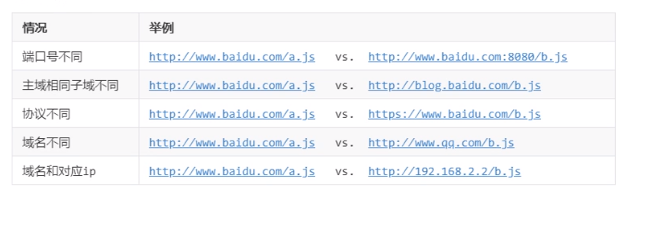

# spring mvc cors 跨域

浏览器因为安全策略，设置了同源策略。同源策略简单理解就是DNS域名，端口号，协议完全相同就叫做同源。同源下的页面之间才能进行js的dom操作，不在一个源下的任何跨文档的dom访问都是被阻止的。不同源下的访问可以称为跨域访问。 多数出现在ajax请求中，在不同域下的请求数据会遇到禁止跨域的问题。



为什么要有同源策略

浏览器不允许跨域

前后端分离需要用到跨域请求

**如何解决跨域？**

主要是要避开Ajax请求，解决同源限制的问题

解决跨域的方式：

基于javascript 标签的 src 方式

基于Jquery 的JSONP 方式 （只能对get 请求生效）

基于CORS的方式 （解决同源的问题）


CORS 跨域资源共享 允许 浏览器 想跨源服务器，发送XMLHttpRequest请求，从而克服了AJAX只能同源使用的限制。浏览器端 都支持该功能

CORS原理：

- 客户端自动向请求头header中注入origin
- 服务器需要向响应头header中注入Access-control-Allow-origin
- 浏览器检测到header 中的 Access-control-Allow-Origin ，就可以跨域操作了。

浏览器讲CORS请求分成两类：简单请求和非简单请求

简单请求：

```java
(1) 请求方法是一下三种之一：
    HEAD
    GET
    POST
(2) HTTP头部包含信息不超过一下几个字段
    Accept
    Accept-Language
    Content-Language
    Last-Event-ID
    Content-Type：只限于application/x-xxx-form-urlencoded、multipart/form-data，text/plain
```

非简单请求：

方法是PUT / DELETE ，content-type: application/json


**当contentType设置为三个常用的格式以外的格式，如“application/json”时，会先发送一个试探的OPTIONS类型的请求给服务端。在这时，单纯的在业务接口response添加Access-Control-Allow-Origin 由于还没有走到所以不会起作用。**


两种解决方案：

springmvc 4.x 以下使用 springmvc拦截器实现

```java
public class AlloworiginInterceptor implements HandlerInceptor {
    public boolean preHandle(HttpServletRequest request,HttpServletResponse response,Object args2) throws Exception {
        if(request.getHeader("Origin") != null) {
            response.setContentType("text/html;Charset=UTF-8");
            // 允许哪一个URL
            response.setHeader("Access-Control-Allow-Origin","*");
            
            // 允许哪种请求方式
            response.setHeader("Access-Control-Allow-Methods","POST,GET,OPTIONS,DELETE");
            response.setHeader("XDomainRequestAllowed",1);
            System.out.println("正在跨域");
        }
        return true;
    }
}
```

JS代码

- JQuery ajax

```javascript
$.ajax({
    url: 'url',
    method: 'get/put/post/delete',
    xhrFileds: {
        withCredentials: true
    },
    success: function(data){
        
    },
    error:function() {
        
    }
})
```

CORS实现2

spring mvc 4.x以上处理CORS跨域方式

方法上加 @CrossOrigin 

某个controller 类上加 @CrossOrigin

或者同意配置一个config 文件

```java
@Configuration
@EnableWebMvc
public class ConfigurerAdapter implements WebMvcConfigurer {

    @Value("${file.path}")
    private String path;

    @Value("${file.avatar}")
    private String avatar;

    @Value("${file.upload}")
    private String upload;

    // 支持跨域请求
    @Override
    public void addCorsMappings(CorsRegistry registry) {
        registry.addMapping("/**")
                .allowCredentials(true)
                .allowedHeaders("*")
                .allowedOrigins("*")
                .allowedMethods("GET", "POST", "PUT", "DELETE");

    }

    @Override
    public void addResourceHandlers(ResourceHandlerRegistry registry) {
        String avatarUtl = "file:" + avatar.replace("\\", "/");
        String pathUtl = "file:" + path.replace("\\", "/");
        String uploadUtl = "file:" + upload.replace("\\", "/");
        registry.addResourceHandler("/avatar/**").addResourceLocations(avatarUtl).setCachePeriod(0);
        registry.addResourceHandler("/file/**").addResourceLocations(pathUtl).setCachePeriod(0);
        //外部静态文件
        registry.addResourceHandler("/upload/**").addResourceLocations(uploadUtl).setCachePeriod(0);
        registry.addResourceHandler("/**").addResourceLocations("classpath:/META-INF/resources/").setCachePeriod(0);
    }
}
```


URL 和 URI的区别

URI ： Uniform Resource Identifier :统一资源标识符

URL: Uniform Resource Location 统一资源定位符


301 和 302 区别

301 Moved Permanently 被请求的资源已永久移动到新位置，并且将来任何对此资源的引用都应该使用本响应返回的若干个URI之一。如果可能，拥有链接编辑功能的客户端应当自动把请求的地址修改为从服务器反馈回来的地址。除非额外指定，否则这个响应也是可缓存的。

302 Found 请求的资源现在临时从不同的URI响应请求。由于这样的重定向是临时的，客户端应当继续向原有地址发送以后的请求。只有在Cache-Control或Expires中进行了指定的情况下，这个响应才是可缓存的。

301 是永久重定向，302是临时重定向

　**301比较常用的场景是使用域名跳转。**

　　比如，我们访问 **http**://www.baidu.com 会跳转到 **https**://www.baidu.com，发送请求之后，就会返回301状态码，然后返回一个location，提示新的地址，浏览器就会拿着这个新的地址去访问。 

　　**注意： 301请求是可以缓存的， 即通过看status code，可以发现后面写着from cache。**

　   **或者你把你的网页的名称从php修改为了html，这个过程中，也会发生永久重定向。**

**302用来做临时跳转**

　　比如未登陆的用户访问用户中心重定向到登录页面。

　　访问404页面会重新定向到首页。 